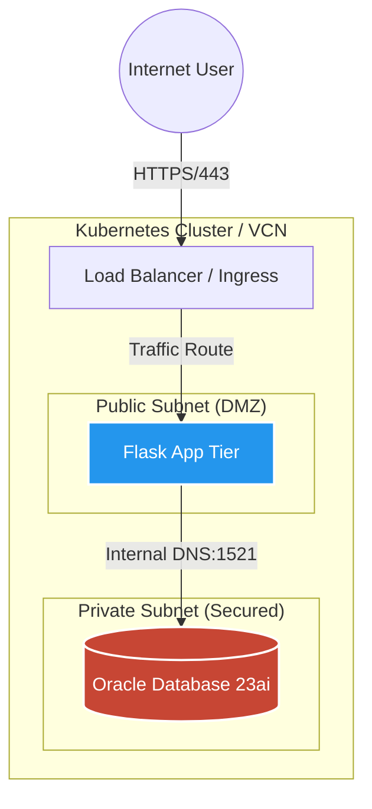
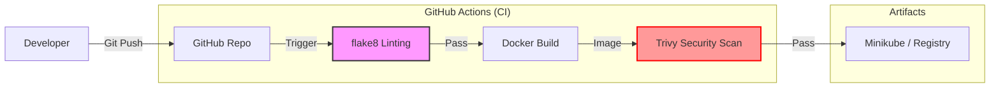

# ☁️ OCI Cloud-Native 3-Tier Application (Kubernetes Migration)

[](https://github.com/soon-oss/oci-3tier-flask-app/actions)


> **🏆 Award Winner:** Rated **Top 500 Learner** (out of 1M+ participants) in the **Oracle Race to Certification 2025**.

## 📖 Project Overview

A production-grade **3-Tier Web Architecture** (Frontend, Backend, Database) designed for the Oracle Cloud Infrastructure (OCI) ecosystem.

Originally built with **Docker Compose**, this project has evolved to implement strict **DevSecOps** principles, including automated CI/CD pipelines and least-privilege container security.

It demonstrates a complete **DevSecOps migration path**:
1.  **Local Development:** Orchestrated with **Docker Compose** for rapid iteration.
2.  **Production Simulation:** Migrated to **Kubernetes** to demonstrate enterprise orchestration, self-healing infrastructure, scaling, and secret management.

---

## 🏗️ Architecture

The application follows a strict **Security-First** network design (Public vs. Private Subnets):



### 🔄 DevSecOps Pipeline Flow
The project implements a fully automated "Commit-to-Container" workflow:



---

## 🚀 Key Features

### 1. **Infrastructure as Code (Terraform)**

* **Automated Provisioning:** Provisions OCI Virtual Cloud Networks (VCN), Subnets, and Security Lists.
* **Cloud-Native Simulation:** Uses Terraform to model OCI VCNs, separating Public (App) and Private (DB) subnets.
* **Zero Trust Networking:** Strict Ingress/Egress rules ensure the Database is never exposed to the public internet.

### 2. **Docker & Container Optimization**

* **Multi-Stage Builds:** Uses a multi-stage `Dockerfile` to compile dependencies and strip build tools, resulting in a lightweight production image.
* **Oracle Thin Mode:** Utilizes `python-oracledb` in "Thin Mode" to connect without heavy Oracle Instant Client libraries, reducing container size by over 300MB.
* **Non-Root Security:** Containers run as a non-privileged `appuser` to enforce least-privilege security.

### 3. **Kubernetes Orchestration (Migration)**

* **Self-Healing:** Defined `ReplicaSets` ensure high availability and automatic pod restarts.
* **Service Discovery:** Internal DNS resolution between App and DB tiers (no hardcoded IPs).
* **Secrets Management:** Sensitive credentials (DB passwords) are decoupled from code using `Kind: Secret` and injected as Environment Variables.

### 4. **DevSecOps & CI/CD**

* **Automated Pipeline:** GitHub Actions automatically lints code (`flake8`) and builds Docker images on every push.
* **Vulnerability Scanning:** Integrated **Trivy** to scan container images for CVEs (High/Critical severity) before deployment.
* **Fail-Fast Logic:** Application refuses to start if required Environment Variables are missing.

---

## 🛠️ Tech Stack

| Component | Technology | Role |
| --- | --- | --- |
| **Frontend/API** | Python Flask | REST API & Web Server |
| **Database** | Oracle Database 23ai | Vector-Ready Relational DB |
| **Orchestration** | Kubernetes (Minikube) / Docker Compose | Container Orchestration |
| **Infrastructure** | Terraform | Infrastructure as Code (IaC) |
| **CI/CD** | GitHub Actions | Automated Testing & Security Scanning |

---

## ⚙️ How to Run

### Clone the Repository
* Git Installed.

Start by getting the code on your local machine:
```bash
git clone [https://github.com/soon-oss/oci-3tier-flask-app.git](https://github.com/soon-oss/oci-3tier-flask-app.git)
cd oci-3tier-flask-app

```

### Choose your Deployment Mode

You can run this project in two modes depending on your environment.

### 🟢 Option A: Kubernetes (Production Simulation)
*Recommended for verifying orchestration and secret management.*

This project includes fully configured manifests for local development using **Minikube**.

### 1. Prerequisites

* Docker Desktop & Minikube installed.
* `kubectl` CLI configured.

### 2. Deployment

```bash
# 1. Start Minikube
minikube start --driver=docker

# 2. Build & Load Image (Local Development)
docker build -t my-flask-app:v1 .
minikube image load my-flask-app:v1

# 3. Apply Secrets (Security)
kubectl apply -f k8s/secrets.yaml

# 4. Deploy Database & App
kubectl apply -f k8s/db-deployment.yaml
kubectl apply -f k8s/db-service.yaml
kubectl apply -f k8s/app-deployment.yaml
kubectl apply -f k8s/app-service.yaml

```

### 3. Verify Deployment

```bash
# Get the Service URL to open in browser
minikube service flask-app-service

```

* **Health Check:** Append `/health` to the URL (Returns JSON DB status).

---

### 🔵 Option B: Docker Compose (Local Development)

*Recommended for rapid testing and checking multi-stage builds.*

### 1. Prerequisites

* Docker & Docker Compose installed.

### 2. Deployment

```bash
# Build and Launch
docker-compose up --build

```

*The App will automatically wait for the Database to be healthy before starting (using Healthchecks).*

### 3. Verify Deployment

* **Web App:** Visit `http://localhost:5000`
* **Health Check:** Visit `http://localhost:5000/health` (Returns JSON DB status).

---

## 📂 Project Structure

```text
├── .github/workflows   # CI/CD Pipeline (Linting + Security Scan)
├── app/                # Flask Application Code
├── k8s/                # Kubernetes Manifests (Deployments, Services, Secrets)
├── terraform/          # Infrastructure as Code (OCI VCN, Subnets)
├── Dockerfile          # Multi-stage container build
└── README.md           # Documentation

```

---

## 👨‍💻 About the Author

**Certified OCI Architect & DevOps Professional**

Building bridges between On-Premise legacy and Cloud-Native futures.

* **Certifications:** OCI Architect Associate, OCI DevOps Professional, OCI Migrations Architect Professional.
* **Focus:** Kubernetes, Terraform, and Secure Cloud Architecture.
* **Contact:** [LinkedIn](https://www.linkedin.com/in/desmond-soon-248889390/)