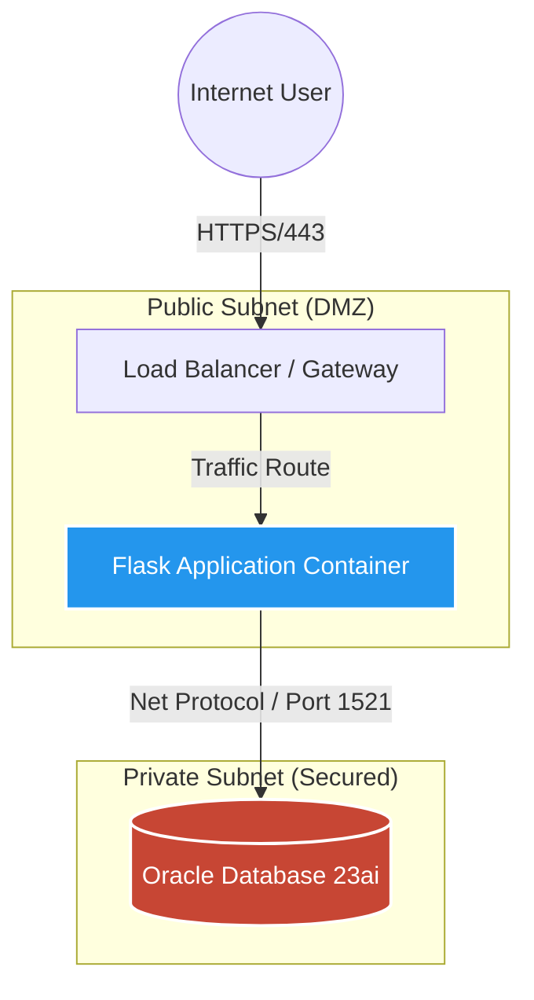

# OCI 3-Tier Cloud-Native Application ☁️


> **🏆 Award Winner:** Rated Top 500 Learner (out of 1M+ participants) in the **Oracle Race to Certification 2025**.

## 📖 Project Overview
This repository demonstrates a **production-grade 3-tier web architecture** designed for the Oracle Cloud Infrastructure (OCI) ecosystem. 

Unlike standard tutorials, this project simulates a real-world enterprise environment locally using **Docker Compose** for orchestration and **Terraform** for network modeling. It implements strict **DevSecOps** principles, including automated CI/CD pipelines, secret management, and least-privilege container security.

### 🏗 Architecture
The application follows a strict separation of concerns (Public vs. Private Subnets) to mimic an OCI VCN design.



## 🚀 Key Features

* **☁️ Cloud-Native Simulation:** Uses **Terraform** (`main.tf`) to model OCI Virtual Cloud Networks (VCN), separating Public (App) and Private (DB) subnets.
* **🐳 Optimized Containers:** Implements **Multi-Stage Docker Builds** to reduce image size and remove build tools from production.
* **🛡️ Enterprise Security:** * **Non-Root User:** Containers run as `appuser`, not root.
* **Secret Management:** Credentials injected via Environment Variables (never hardcoded).
* **Oracle Thin Mode:** Uses `python-oracledb` for efficient, client-less connections.


* **🤖 Automated DevOps:** A **GitHub Actions** pipeline automatically lints code (`flake8`), builds Docker images, and scans for vulnerabilities (`Trivy`) on every push.

## 🛠 Tech Stack

| Component | Technology | Role |
| --- | --- | --- |
| **Frontend/API** | Python Flask | REST API & Web Server |
| **Database** | Oracle Database 23ai | Vector-Ready Relational DB |
| **Infrastructure** | Terraform | Infrastructure as Code (IaC) |
| **Orchestration** | Docker Compose | Local Microservices Management |
| **CI/CD** | GitHub Actions | Automated Testing & Security Scanning |

## ⚡ Quick Start

### Prerequisites

* Docker & Docker Compose installed.
* Git installed.

### 1. Clone the Repository

```bash
git clone [https://github.com/soon-oss/oci-3tier-flask-app.git](https://github.com/soon-oss/oci-3tier-flask-app.git)
cd oci-3tier-flask-app

```

### 2. Launch the Stack

This command spins up the Database and App. The App will automatically **wait** for the Database to be healthy before starting (using Healthchecks).

```bash
docker-compose up --build

```

### 3. Verify Deployment

* **Web App:** Visit `http://localhost:5000`
* **Health Check:** Visit `http://localhost:5000/health` (Returns JSON DB status)

## 👨‍💻 About the Author

**Certified OCI Architect & DevOps Professional**

Building bridges between On-Premise legacy and Cloud-Native futures.

* **Certifications:** OCI Architect Associate, OCI DevOps Professional, OCI Migrations Architect Professional.
* **Focus:** Kubernetes, Terraform, and Secure Cloud Architecture.
* **Contact:** [[LinkedIn](https://www.linkedin.com/in/desmond-soon-248889390/)]