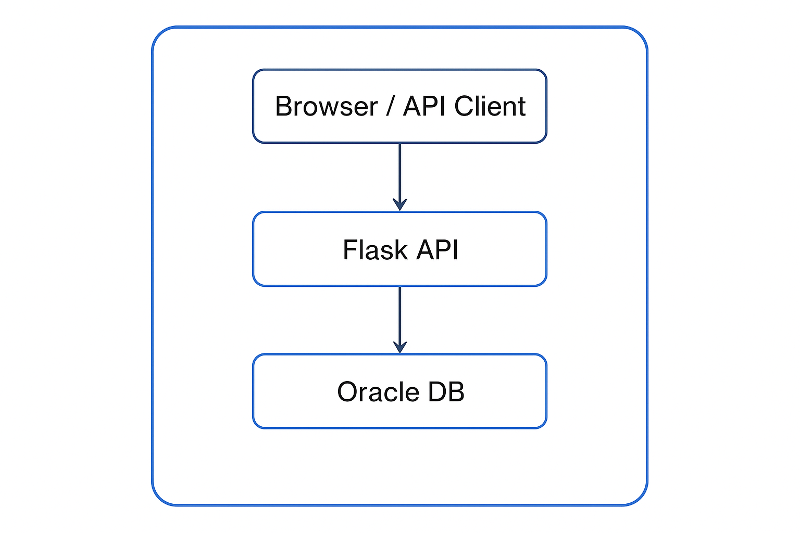

# OCI 3-Tier Flask App (Portfolio Project)

A containerised 3-tier web application built with Flask, Oracle XE Database, and Docker Compose.  
This project simulates a typical cloud-native architecture that could be deployed on Oracle Cloud Infrastructure (OCI) or any modern cloud platform.

---

## 🏗 Architecture



---

## ⚙️ Tech Stack
- Python 3.10  
- Flask (REST API)  
- Oracle XE 21c Database (Dockerized)  
- Docker / Docker Compose  

---

## How to run

1. Clone the repository:

   ```bash
   git clone https://github.com/soon-oss/oci-3tier-flask-app.git
   cd oci-3tier-flask-app
   ```

3. Build and start the containers:

   ```bash
   docker compose up --build -d
   docker exec -it oracle-db bash -c "createAppUser APPUSER AppPass123"
   docker compose restart flask-app
   ```

4. Access the Flask app:
   
- API base: http://localhost:5000
- Health check: http://localhost:5000/health
- Users endpoint: http://localhost:5000/users

---

## Features

- /health → verifies the app is running
- /users → fetches dummy users from the Oracle DB

---

## ☁️ Target Cloud Architecture (OCI)

This application is designed to be deployed on Oracle Cloud Infrastructure (OCI) using a standard, production-style 3-tier architecture.

**Proposed OCI deployment design:**
- OCI Virtual Cloud Network (VCN) with public and private subnets
- Public Load Balancer exposing the Flask API
- Compute Instances or OCI Container Instances running the Flask application
- Oracle Autonomous Database or Oracle Database on OCI Compute as the backend datastore
- IAM policies to control access between services
- Security lists and network segmentation to isolate application and database tiers
- Optional CI/CD automation using OCI DevOps for build and deployment

This design follows cloud best practices for scalability, security, and separation of concerns, and can be adapted to other major cloud platforms with minimal changes.

---

## Next Steps

- Deploy the application to Oracle Cloud Infrastructure using OCI Compute or Container Instances
- Implement CI/CD automation using OCI DevOps
- Add JWT-based authentication and authorization
- Introduce a frontend UI (React or Bootstrap)
- Enhance observability with logging and monitoring

---

👤 Author
Created by soon-oss
